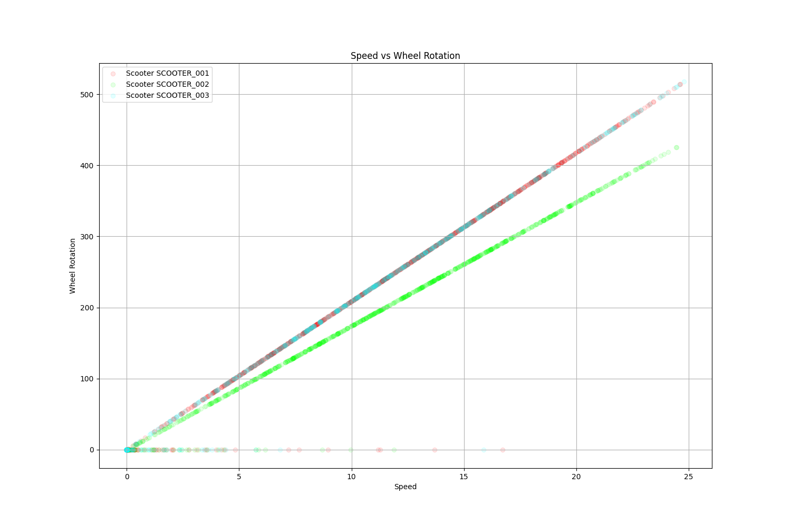
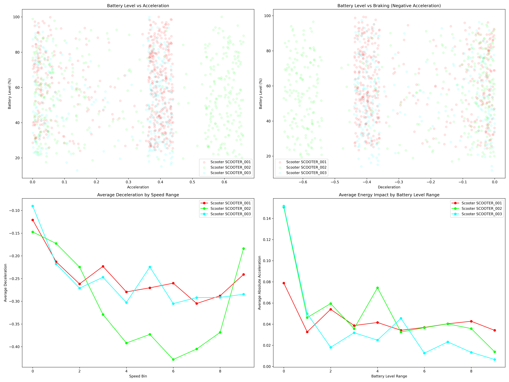
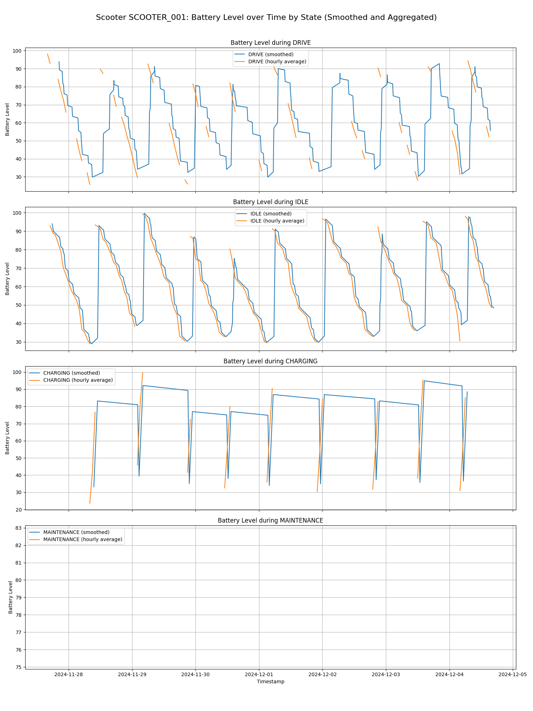
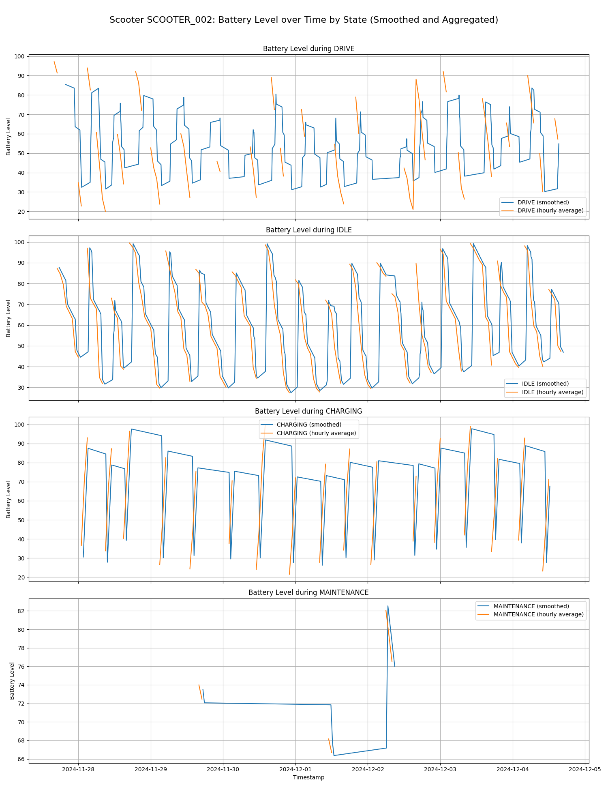
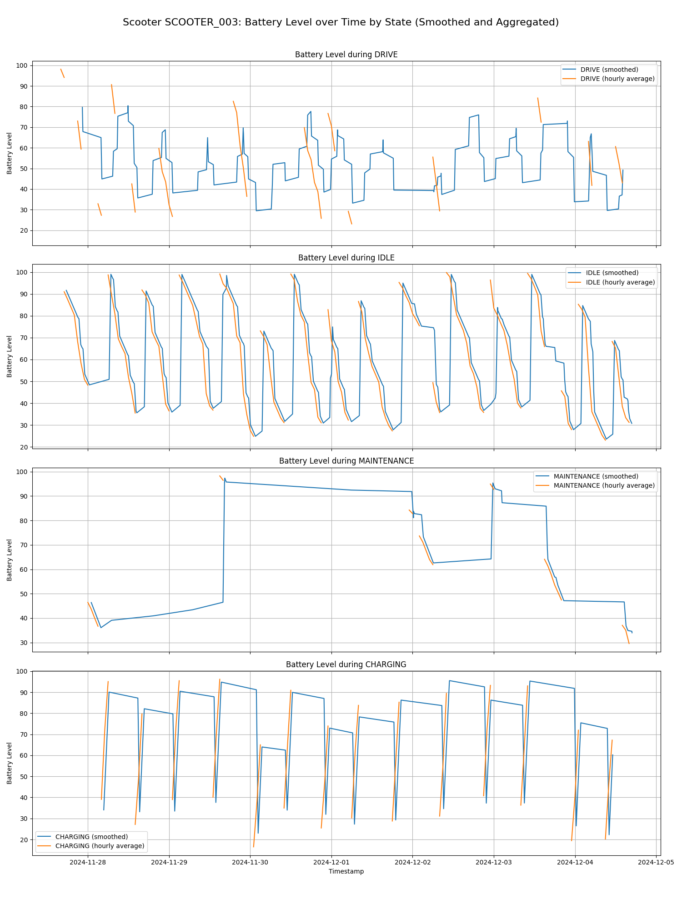
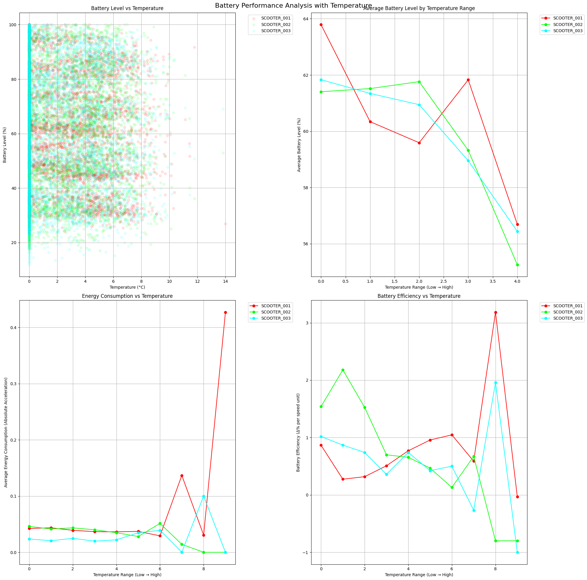
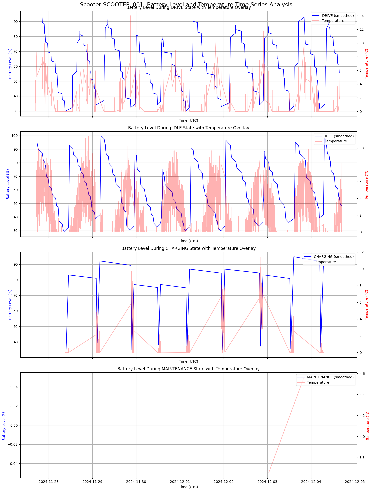
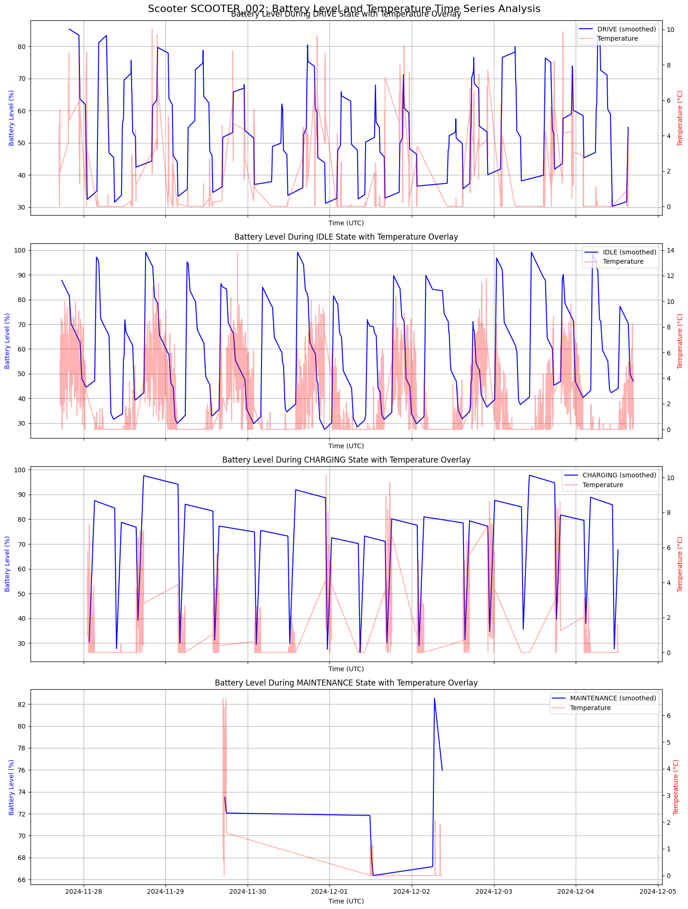
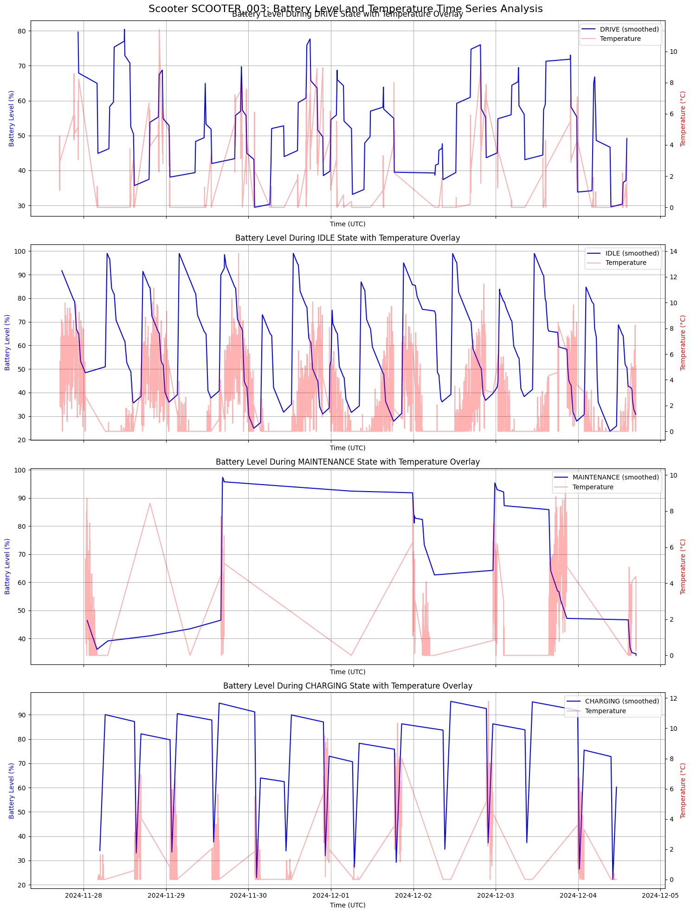
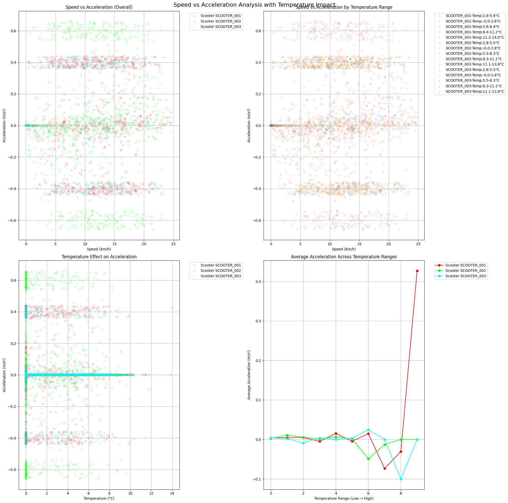

# Telemetry E-Scooter Analysis

## Setup

Copy data to `data/*.txt`:

```bash
pip install -r requirements.txt
python src/scooter_analysis.py
```

## Hardware Comparison

### Wheel Size Configuration

Looking at the [Speed vs Wheel Rotation graph](analysis_output/wheel_rotation_analysis.png):



- **SCOOTER_001** and **SCOOTER_003** show steeper slopes (red and blue lines, ~500 rotations at 25 speed).
- **SCOOTER_002** has a notably different slope (green line, ~400 rotations at 25 speed).

This confirms the different wheel sizes through their rotation ratios.

### Motor & Controller System

From the ["Battery Level vs Acceleration and Battery Level vs Braking"](analysis_output/battery_performance_analysis.png) plot:



- **SCOOTER_002** shows data points spread across a wider acceleration/deceleration range.
- The "Average Acceleration/Deceleration by Speed Range" graph shows **SCOOTER_002** reaching deeper values (-0.6, 0.6) compared to others (-0.4, 0.4).

This supports **SCOOTER_002** having superior motor/controller capabilities.

#### Energy Impact

The "Average Energy Impact by Battery Level Range" graph shows:

- Assumed energy consumption is related to absolute acceleration.
- **SCOOTER_002** has higher energy impact across battery levels.
- **SCOOTER_001** and **SCOOTER_003** have nearly identical energy impact curves.

### Battery Characteristics

From [State graphs SCOOTER_001](analysis_output/battery_state_smoothed_SCOOTER_001.png), [State graphs SCOOTER_002](analysis_output/battery_state_smoothed_SCOOTER_002.png), and [State graphs SCOOTER_003](analysis_output/battery_state_smoothed_SCOOTER_003.png) (Battery Level over Time plots):





#### Charging Patterns

- **SCOOTER_002** shows more linear charging curves.
- **SCOOTER_001** and **SCOOTER_003** display similar charging patterns.

#### Discharge Patterns

- **SCOOTER_002**'s drive mode shows more frequent and deeper discharge cycles.
- **SCOOTER_001** and **SCOOTER_003** show very similar discharge patterns in both drive and idle modes.

This supports **SCOOTER_002** having different battery chemistry or a different battery management system (BMS).

#### Summary

- The distinct wheel size configurations.
- **SCOOTER_002**'s different motor/controller system.
- The similarity between **SCOOTER_001** and **SCOOTER_003**'s battery systems.
- **SCOOTER_002**'s unique battery management characteristics.

## Battery Performance vs Temperature

```bash
python src/scooter_analysis_weather.py
```

From [battery_performance_temperature](analysis_output_temperature/battery_performance_temperature.png):



**SCOOTER_002** likely has a more advanced battery thermal management system and **SCOOTER_001** and **SCOOTER_003** continue to show similar battery hardware because:

- **SCOOTER_001** (red): Steadily decreases from 64% as temperature increases.
- **SCOOTER_002** (green): Most stable, until high temperatures.
- **SCOOTER_003** (blue): Stable until high temperatures, then sharp drop to 53%.

### Energy Consumption vs Temperature

- **SCOOTER_001** (red): High energy consumption spike at higher temperatures.
- **SCOOTER_002** (green): Moderate consumption with a small peak at mid-range.
- **SCOOTER_003** (blue): Most efficient with consistently lowest energy consumption.

From [battery_state_temperature_SCOOTER_001](analysis_output_temperature/battery_state_temperature_SCOOTER_001.png), [battery_state_temperature_SCOOTER_002](analysis_output_temperature/battery_state_temperature_SCOOTER_002.png), and [battery_state_temperature_SCOOTER_003](analysis_output_temperature/battery_state_temperature_SCOOTER_003.png):





#### During DRIVE state:

- **SCOOTER_001**: Shows more erratic discharge patterns (more jagged blue lines).
- **SCOOTER_002**: More stable discharge curve, maintains higher average levels.
- **SCOOTER_003**: Similar to **SCOOTER_001** but with slightly smoother discharge.

From [speed_acceleration_temperature](analysis_output_temperature/speed_acceleration_temperature.png):



### Performance Impact

- **SCOOTER_001**: Shows unusual acceleration spike at higher temperatures.
- **SCOOTER_002** & **SCOOTER_003**: More consistent acceleration profiles.

#### Summary

- **SCOOTER_002** has superior thermal management and likely a different battery chemistry.
- **SCOOTER_001** and **SCOOTER_003** share similar hardware limitations regarding temperature sensitivity. **SCOOTER_003** performs more reliably within its design limitations relative to **SCOOTER_002**.

## Caveats

1. Absolute acceleration is used as a proxy for energy consumption, which is a simplification.
2. Additional factors affecting energy consumption:
    - Motor efficiency
    - Rider weight
    - Terrain conditions
3. Recommendations for more accurate analysis:
    - Review specific model specifications.
    - Analyze raw battery voltage and current data.
    - Conduct controlled testing under identical conditions.

## Discussion

- By knowing the battery drain rate at different temperatures, companies can plan better for maintenance and charging schedules. This ensures that scooters are available for use and reduces downtime.
- Maintenance Planning:
  - Schedule preventive maintenance based on temperature forecasts.
  - Additional monitoring for **SCOOTER_001** during warmer periods, due to potential component damage.
- Fleet Management:
  - Deploy **SCOOTER_002** during temperature-volatile periods
  - Rotate fleet based on temperature predictions
  - Maintain higher availability of backup units during temperature extremes

